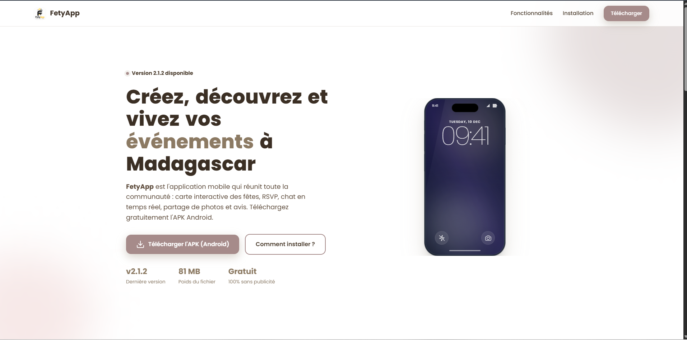
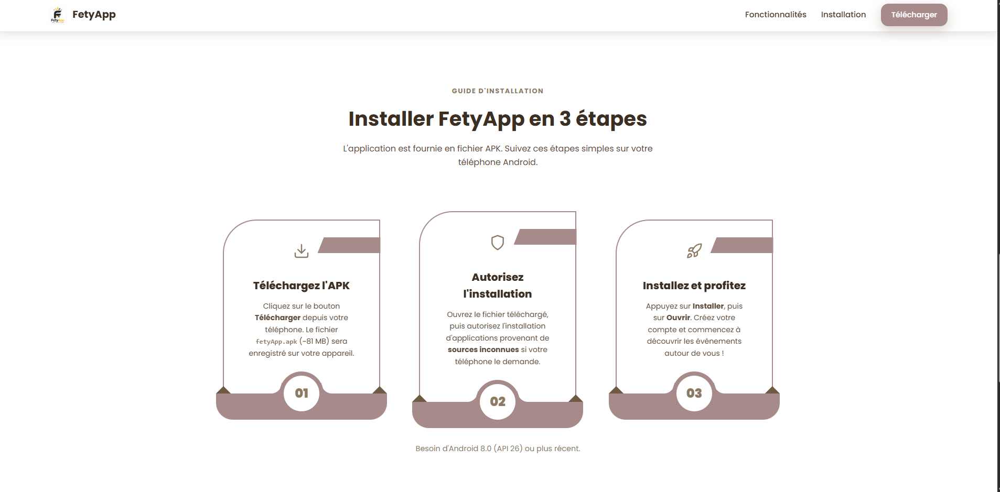
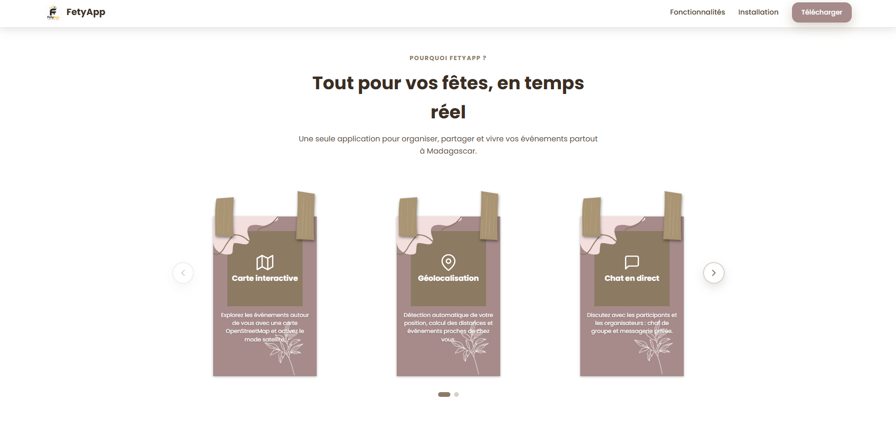

# FetyApp — Page de téléchargement

Simple page web statique permettant à tout le monde de télécharger l'application mobile **FetyApp** (APK Android).


<p align="center">
  
  <br/>
</p>


## Contenu

- `index.html` — structure de la page (HTML uniquement)
- `css/style.css` — toutes les feuilles de style et animations CSS
- `js/main.js` — toutes les animations et interactions JavaScript
- `assets/logo.png` — logo de l'application
- `assets/favicon.png` — favicon

## Lien de téléchargement

Le bouton de téléchargement pointe vers l'APK hébergé sur la release GitHub :


<p align="center">
  
  <br/>
</p>


> **Important :** pour mettre à jour le lien après une nouvelle release, remplacez
> `v2.1.2` et `fetyApp.apk` par le tag et le nom du fichier de la nouvelle release
> dans `index.html` (2 occurrences : héro et section CTA finale).

## Tester en local

```bash
# Depuis le dossier du projet
cd fetyapp-download
python -m http.server 8080
# puis ouvrir http://localhost:8080
```

## Déployer gratuitement

https://fetyapp-mada.onrender.com/


<p align="center">
  
  <br/>
</p>


## Remarques

- Ce dossier possède son propre dépôt git (`main`). Pour committer une modification :
  ```bash
  cd fetyapp-download
  git add .
  git commit -m "description de la modification"
  git push
  ```
- Le dépôt principal du projet ignore ce dossier (`.gitignore` du projet : `fetyapp-download/`).
- L'APK (~81 MB) est hébergé sur GitHub Releases, il n'est donc **pas** copié dans
  ce dossier pour éviter de dupliquer le fichier. La page fonctionne partout tant
  que le lien de la release est public.
- Si vous préférez héberger l'APK avec la page, copiez `fetyApp.apk` dans ce dossier
  et remplacez les liens GitHub par `fetyApp.apk`.
